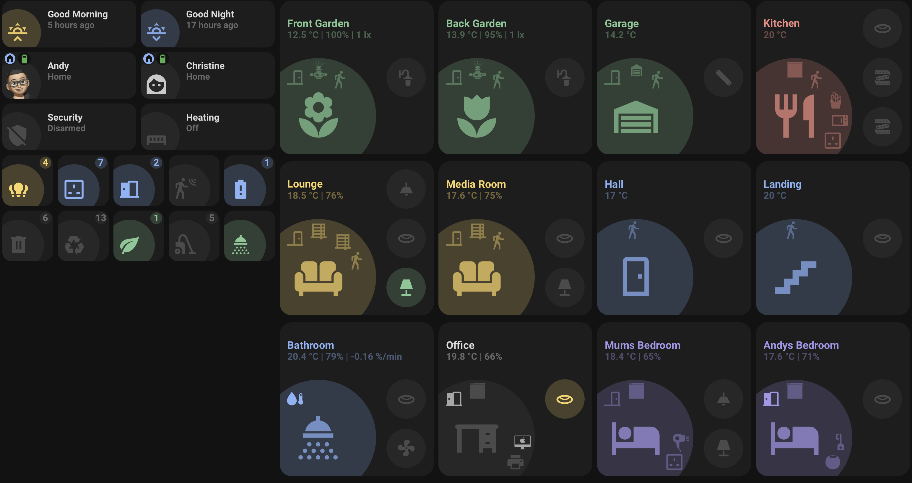

# Minimalist Custom Cards
My custom cards for Minimalist UI.



If your having issue with these cards, make sure you have all the necessary frontend integrations installed.

first you need to have installed `UI Lovelace Minimalist`, if you have not installed it yet click here to install it.
[](https://my.home-assistant.io/redirect/config_flow_start/?domain=ui_lovelace_minimalist)
Then restart Home  Assistant.

Then to go to [](https://my.home-assistant.io/redirect/integration/?domain=ui_lovelace_minimalist), then click on `Configure`, then make sure that `Include custom card resources it's depending on.` is **UN-CHECKED**, and click `SUBMIT`

then, goto to HACS → frontend and install these:
```
button-card
lovelace-card-mod
mini-graph-card
mini-media-player
my-cards
light-entity-card
auto-entities
simple-weather-card
```
my-cards is one integration that might not be in HACS repository click on the link to install it [](https://my.home-assistant.io/redirect/hacs_repository/?repository=my-cards&owner=AnthonMS&category=frontend)

Then restart Home Assistant again, then you can proceed to add my custom cards, by downloading them and upload the folders to Home assistant folder `/config/ui_lovelace_minimalist/custom_cards`
