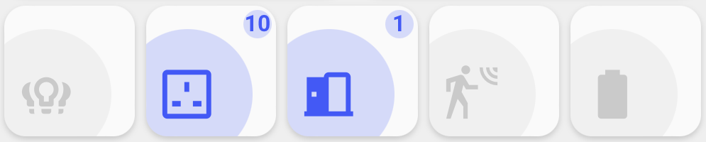
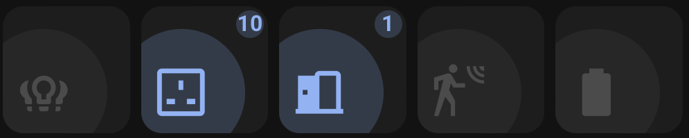

<!-- markdownlint-disable MD046 -->

## Description




## Credits

- Authors:
    - AndyBlac

## Changelog

<details>
<summary>1.2.1</summary>
Initial release
</details>

## Variables

| Variable                                     | Default | Required    | Notes             |
|----------------------------------------------|---------|-------------|-------------------|
| entity                                       |         | Yes         | The sensor entity |
| ulm_custom_card_andyblac_count_info_color_on |         | No          | This lets you change the colour of the icon and background, when state is 'on' |
| ulm_custom_card_andyblac_count_info_badge_bg | `true`  | No          | This lets you show / hide the badge background |

## Default card options

| Options                                | Default         | Required    | Notes          | Requirement |
|----------------------------------------|-----------------|-------------|----------------|-------------|
| entity                                 |                 | No          | The entity_id for the card | |
| icon                                   |                 | No          | Icon to display. Defaults to the entity icon | |
| tap_action                             | `more-info`     | No          | Define the type of action on click, if undefined, toggle will be used.</br>See [Action](https://github.com/custom-cards/button-card#Action)| |
| hold_action                            |                 | No          | Define the type of action on hold, if undefined, nothing happens</br> See [Action](https://github.com/custom-cards/button-card#Action)| |
| label                                  |                 | No          | Shows the state of the sensor, you can also use code here |

## Usage

```yaml
- type: custom:button-card
  entity: sensor.rubbish_collection
  label: "[[[ return entity.attributes.daysTo ]]]"
  template:
    - custom_card_andyblac_count_info
  variables:
    ulm_custom_card_andyblac_count_info_color_on: green
```

??? note "Template Code"

    ```yaml title="custom_card_andyblac_count_info.yaml"
    --8<-- "custom_cards/custom_card_andyblac_scenes/custom_card_andyblac_count_info.yaml"
    ```
