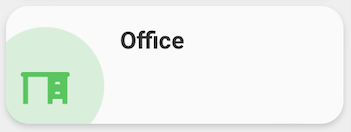
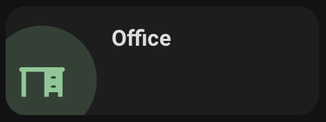

<!-- markdownlint-disable MD046 -->

## Description




This card let you navigatw to a new dashboard by tapping on the icon.

## Credits

- Authors:
    - AndyBlac

## Changelog

<details>
<summary>1.0</summary>
Initial release
</details>

## Variables

| Variable                                       | Default | Required    | Notes                                                       |
|------------------------------------------------|---------|-------------|-------------------------------------------------------------|
| ulm_custom_card_andyblac_navigate_path         |         | Yes         | The navigation location name.                               |
| ulm_custom_card_andyblac_navigation_color      |         | No          | This lets you change the colour of the icon and background. |
| ulm_custom_card_andyblac_navigation_text_color |         | No          | This lets you change the colour of the text.                |

## Template

| Variable                                       | Default         | Required    | Notes                                                                      |
|------------------------------------------------|-----------------|-------------|----------------------------------------------------------------------------|
| name                                           |                 | No          | The name of location to be displayed.                                      |
| label                                          |                 | No          | Secondary label to be displayed.                                           |
| icon                                           |                 | No          | Allows you set an icon of your choice.                                     |

## Usage

For the colour, you can use any colour in your theme that uses the following naming structure `color-red: "241, 139, 130"` or `color-yellow: "252, 214, 99"`,
so for example `color-background-purple: "var(--color-purple)"` in your theme, you would ignore the text `color-` and just set `background-purple`,
you can also use custom colours by using for example `rgb(255,0,0)`

```yaml
  - type: custom:button-card
    icon: mdi:desk
    name: Office
    template:
      - custom_card_andyblac_navigation
    variables:
      ulm_custom_card_andyblac_navigate_path: office
      ulm_custom_card_andyblac_navigation_color: green
      ulm_custom_card_andyblac_navigation_text_color: green
```
