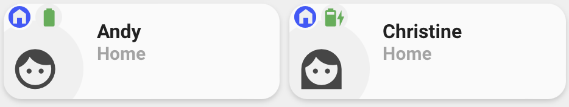

<!-- markdownlint-disable MD046 -->

## Description




This card shows if a person is `Home` or `Away`. If you have setup other zones, it will show these as well, it also shows you your battery level.

## Credits

- Authors:
    - AndyBlac
- Full credit to the Minimalist UI team for creating the base card that this 'mod' was used.

## Changelog

<details>
<summary>1.2.0</summary>
Initial release
<summary>1.2.1</summary>
Fix card info text layout
</details>

## Variables

| Variable | Default | Required         | Notes             |
|----------|---------|------------------|-------------------|
| entity   |         | Yes | The person entity |
| ulm_card_person_use_entity_picture |  | No | If you set this to true, the card shows the entity picture from your user, otherwise (set to false) shows the icon. Default is false. |
| ulm_card_person_icon | mdi:face-man | No | Sets the icon to display if entity picture not shown. |
| ulm_card_person_eta  |         | No | Sensor with ETA info from integrations like: [Waze](https://www.home-assistant.io/integrations/waze_travel_time/), [Google](https://www.home-assistant.io/integrations/google_travel_time/) and [HERE](https://www.home-assistant.io/integrations/here_travel_time/) |
| ulm_address |   | No | Show an address as label, add an entity with a geo location |
| battery     |   | No | Battery object (see below) |

## Battery object

| Variable    | Default         | Required  | Notes          | 
|-------------|-----------------|-----------|----------------|
| entity_id   |                 | Yes       | The entity_id of the battery icon, Required when using battery object |

## Usage

```yaml
- type: 'custom:button-card'
  template: custom_card_andyblac_person
  entity: person.username
  variables:
    ulm_card_person_use_entity_picture: true
    ulm_card_person_icon: mdi:face-woman
    ulm_card_person_eta: sensor.waze_travel_time_person
    ulm_address: sensor.andys_iphone_zone_name
    battery:
      entity_id: sensor.iphone_battery_level
```

??? note "Template Code"

    ```yaml title="custom_card_andyblac_person.yaml"
    --8<-- "custom_cards/custom_card_andyblac_person/custom_card_andyblac_person.yaml"
    ```
