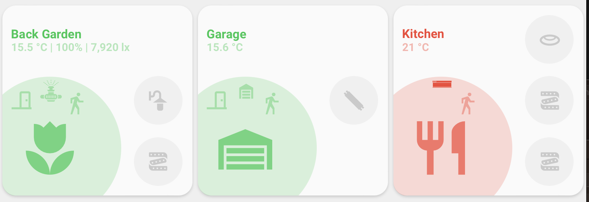
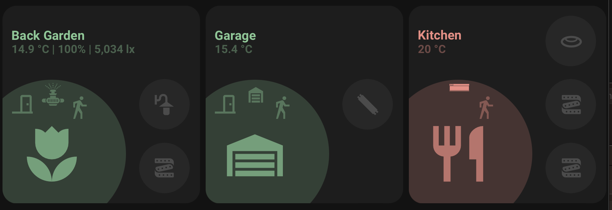

<!-- markdownlint-disable MD046 -->

## Description




This is the `room-card`, used to show the state of single room in a quick glance.
The card has support for up to 4 sub-icons at the right side of the card, and 6 sensor sub-icons going around the inside of the room icon. These can be configured using custom colors and tap actions.

## Credits

- Authors:
    - AndyBlac
- Contributors:
    - Mon3y78
- Full credit to the Minimalist UI team for creating the base card that this 'mod' was used.

## Breaking Changes

<details>
<summary>2.2</summary>
rename climate to custom_2</br>
</details>

## Changelog

<details>
<summary>2.0</summary>
Initial release
</details>
<details>
<summary>2.0.1</summary>
Rename variable 'ulm_custom_card_room_use_light_color' to 'ulm_custom_card_andyblac_room_use_light_color'
</details>
<details>
<summary>2.0.2</summary>
fix state detection for room entity objects</br>
add support for more sensor label variations</br>
 - sensor_label_1 and sensor_label_3</br>
 - sensor_label_2 and sensor_label_3</br>
 - sensor_label_2 by-self</br>
 - sensor_label_3 by-self</br>
</details>
<details>
<summary>2.0.3</summary>
add room icon animations
</details>
<details>
<summary>2.0.4</summary>
add climate control button</br>
add ulm_custom_card_andyblac_room_use_small_room_icon</br>
add ulm_custom_card_andyblac_room_color_on</br>
</details>
<details>
<summary>2.0.5</summary>
add ulm_custom_card_andyblac_room_sensor_show_on_state_only</br>
add missing `unavailable` indicator for sensor icon</br>
change colour of `unavailable` indicator to orange</br>
</details>
<details>
<summary>2.1</summary>
add support for custom colours by using `rgb()`</br>
sensor buttons can also use `rgba()`</br>
</details>
<details>
<summary>2.2</summary>
add additional custom button</br>
rename climate to custom_2</br>
</details>
<details>
<summary>2.2.1</summary>
tweak entity error icon colour, so it matches the system default</br>
tweak label width to give the most info possible</br>
add custom colour support to room entities OFF state</br>
</details>

## Room Variables

| Variable                                                 | Default         | Required    | Notes                                                                      |
|----------------------------------------------------------|-----------------|-------------|----------------------------------------------------------------------------|
| ulm_custom_card_andyblac_room_color                      | `theme`         | No          | This lets you set the room colour                                          |
| ulm_custom_card_andyblac_room_color_on                   | `Room colour`   | No          | This lets you set the room icon colour if the state is `on` (this requires a room entity) |
| ulm_custom_card_andyblac_room_use_label_icons            | `false`         | No          | This option lets you see an icon next to the text of the sensor_label information (🌡️ / 💧 / 🔆 ) |
| ulm_custom_card_andyblac_room_use_small_label_font       | `false`         | No          | My card uses slightly larger fonts than the original card, to use use the orignal card font size set this to `true` |
| ulm_custom_card_andyblac_room_use_small_room_icon        | `false`         | No          | This option lets you set the room icon slightly smaller, this can useful when using the climate button |
| sensor_label_1                                           |                 | No          | The enitiy_id of a sensor you wish to display the state of                 |
| sensor_label_2                                           |                 | No          | The enitiy_id of a sensor you wish to display the state of                 |
| sensor_label_3                                           |                 | No          | The enitiy_id of a sensor you wish to display the state of                 |
| entity_1                                                 |                 | No          | `room_entity` object (see below)                                           |
| entity_2                                                 |                 | No          | `room_entity` object (see below)                                           |
| entity_3                                                 |                 | No          | `room_entity` object (see below)                                           |
| entity_4                                                 |                 | No          | `room_entity` object (see below)                                           |
| sensor_1                                                 |                 | No          | `sensor` object (see below)                                                |
| sensor_2                                                 |                 | No          | `sensor` object (see below)                                                |
| sensor_3                                                 |                 | No          | `sensor` object (see below)                                                |
| sensor_4                                                 |                 | No          | `sensor` object (see below)                                                |
| sensor_5                                                 |                 | No          | `sensor` object (see below)                                                |
| sensor_6                                                 |                 | No          | `sensor` object (see below)                                                |
| custom_1                                                 |                 | No          | `custom_1` object (see below)                                              |
| custom_2                                                 |                 | No          | `custom_2` object (see below)                                              |

## Room Entity object

| Variable                                                 | Default         | Required    | Notes                                                                      |
|----------------------------------------------------------|-----------------|-------------|----------------------------------------------------------------------------|
| entity_id                                                |                 | No          | The entity_id of the widget to control                                     |
| icon                                                     |                 | No          | Allows you set an icon of your choice                                      |
| templates                                                |                 | No          | List of the additional button card templates to apply to this icon         |
| tap_action                                               |                 | No          | tap_action for the icon (see button card documentation for options)        |
| hold_action                                              |                 | No          | hold_action for the icon (see button card documentation for options)       |

## Room Entity Variables

| Variable                                                 | Default         | Required    | Notes                                                                      |
|----------------------------------------------------------|-----------------|-------------|----------------------------------------------------------------------------|
| ulm_custom_card_andyblac_room_icon_color_on              |                 | No          | Allows you to change the color of the entity color if state is `on`        |
| ulm_custom_card_andyblac_room_use_light_color            |                 | No          | This will set the colour of the icon to what colour the light is currently |

## Sensor object

| Variable                                                 | Default         | Required    | Notes                                                                      |
|----------------------------------------------------------|-----------------|-------------|----------------------------------------------------------------------------|
| entity_id                                                |                 | No          | The entity_id of the sensor                                                |
| icon                                                     |                 | No          | Allows you set an icon of your choice                                      |
| templates                                                |                 | No          | List of the additional button card templates to apply to this icon         |
| tap_action                                               |                 | No          | tap_action for the icon (see button card documentation for options)        |
| hold_action                                              |                 | No          | hold_action for the icon (see button card documentation for options)       |

## Sensor Variables

| Variable                                                 | Default         | Required    | Notes                                                                      |
|----------------------------------------------------------|-----------------|-------------|----------------------------------------------------------------------------|
| ulm_custom_card_andyblac_room_sensor_color               | `Room colour`   | No          | Allows you to change the color of the sensor color if state is `off`       |
| ulm_custom_card_andyblac_room_sensor_color_on            | `Room colour`   | No          | Allows you to change the color of the sensor color if state is `on`        |
| ulm_custom_card_andyblac_room_sensor_show_on_state_only  | `false`         | No          | Allows you to show the button only if state is `on`                        |

## Custom object

| Variable                                                 | Default         | Required    | Notes                                                                      |
|----------------------------------------------------------|-----------------|-------------|----------------------------------------------------------------------------|
| entity_id                                                |                 | No          | The entity_id of the custom button                                         |
| icon                                                     |                 | No          | Allows you set an icon of your choice                                      |
| templates                                                |                 | No          | List of the additional button card templates to apply to this icon         |
| tap_action                                               | `more-info`     | No          | tap_action for the icon (see button card documentation for options)        |
| hold_action                                              |                 | No          | hold_action for the icon (see button card documentation for options)       |

## Default card options

All the options from the button card are still available for the large room card.
If you want to tweak this card a little bit more, below are some examples. The full list can be found here: [link](https://github.com/custom-cards/button-card#main-options)

| Options                                                 | Default         | Required         | Notes                                                                 |
|---------------------------------------------------------|-----------------|------------------|-----------------------------------------------------------------------|
| entity                                                  |                 | No | The entity_id for the large card                                                    |
| icon                                                    |                 | No | Icon to display. Defaults to the entity icon                                        |
| tap_action                                              | `navigate`      | No | Define the type of action on click, if undefined, toggle will be used.</br>See [Action](https://github.com/custom-cards/button-card#Action) |
| hold_action                                             |                 | No | Define the type of action on hold, if undefined, nothing happens</br> See [Action](https://github.com/custom-cards/button-card#Action) |
| label                                                   |                 | No | Change the label text                                                               |
| name                                                    |                 | No | Change the title text                                                               |

## Usage

For colours, you can use any colour in your theme that uses the following naming structure `color-red: "241, 139, 130"` or `color-yellow: "252, 214, 99"`,
so for example `color-background-purple: "var(--color-purple)"` in your theme, you would ignore the text `color-` and just set `background-purple`,
you can also use custom colours by using for example `rgb(255,0,0)`

```yaml
  - type: custom:button-card
    template:
      - custom_card_andyblac_room
    name: "Bathroom"
    tap_action:
      action: navigate
      navigation_path: bathroom
    variables:
      ulm_custom_card_andyblac_room_color: blue
      sensor_label_1: sensor.bathroom_humidity_sensor_temperature
      sensor_label_2: sensor.bathroom_humidity_sensor_humidity
      sensor_label_3: sensor.bathroom_humidity_derivative
      custom_2:
        entity_id: climate.bathroom
      sensor_1:
        entity_id: input_boolean.hot_water_toggle
        tap_action:
          action: toggle
      entity_3:
        entity_id: light.bathroom_light
        ulm_custom_card_andyblac_room_icon_color_on: yellow
      entity_4:
        entity_id: fan.bathroom_extractor
        ulm_custom_card_andyblac_room_icon_color_on: rgb(77, 195, 255)
        templates:
          - fan_animation
```

??? note "Template Code"

    ```yaml title="card_room.yaml"
    --8<-- "custom_cards/custom_card_andyblac_room/custom_card_andyblac_room.yaml"
    ```
