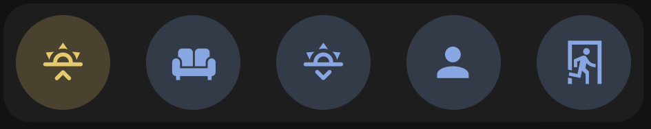

<!-- markdownlint-disable MD046 -->

## Description




This card let you activate a scene by tapping on the icon.

## Credits

- Authors:
    - AndyBlac

## Changelog

<details>
<summary>1.0</summary>
Initial release
</details>

## Variables

| Variable                             | Default | Required    | Notes                                                       |
|--------------------------------------|---------|-------------|-------------------------------------------------------------|
| entity                               |         | Yes         | The scene entity                                            |
| ulm_custom_card_andyblac_scene_color |         | No          | This lets you change the colour of the icon and background. |

## Usage

For the colour, you can use any colour in your theme that uses the following naming structure `color-red: "241, 139, 130"` or `color-yellow: "252, 214, 99"`,
so for example `color-background-purple: "var(--color-purple)"` in your theme, you would ignore the text `color-` and just set `background-purple`,
you can also use custom colours by using for example `rgb(255,0,0)`

```yaml
      - type: custom:button-card
        template: custom_card_andyblac_scene_icon_only_
        entity: scene.good_morning
        variables:
          ulm_card_scene_color: yellow
```

??? note "Template Code"

    ```yaml title="custom_card_andyblac_scenes.yaml"
    --8<-- "custom_cards/custom_card_andyblac_scenes/custom_card_andyblac_scenes.yaml"
    ```
