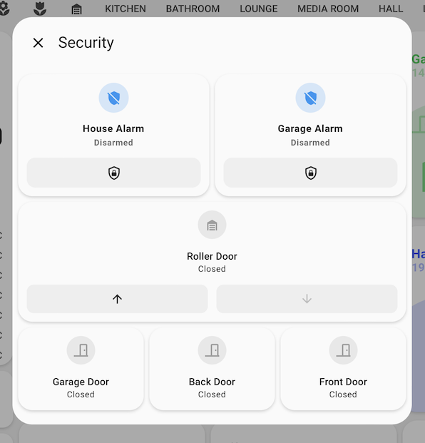
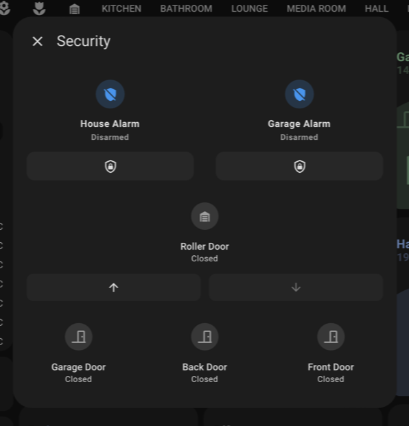

<!-- markdownlint-disable MD046 -->

## Description




## Credits

- Authors:
    - AndyBlac

## Changelog

<details>
<summary>1.0</summary>
Initial release
</details>

## Variables

| Variable      | Default | Required    | Notes             |
|---------------|---------|-------------|-------------------|
| popup_title   |         | No          | This sets the Title of the popup card |
| popup_content |         | No          | This sets the Content of the popup card (see below on how to format) |

## Templates

| Template                   | Notes                                                | 
|----------------------------|------------------------------------------------------|
| custom_popup_andyblac_tap  | Use to make `tap_action` to activate the popup card  |
| custom_popup_andyblac_hold | Use to make `hold_action` to activate the popup card |

## Usage
In order to use a popup card you need to create a YAML file to display, then include it into the `popup_content` variable.
As an example create a file called `security-popup.yaml` in the same folder as your dashboard files, then code your cards you want to show.
</br>**PLEASE NOTE** there is no `- ` on the first card, this is important.
```yaml
type: vertical-stack
cards:
  - type: horizontal-stack
    cards:
      - type: custom:mushroom-alarm-control-panel-card
        entity: alarm_control_panel.house_alarm
        states:
          - armed_away
        layout: vertical
      - type: custom:mushroom-alarm-control-panel-card
        entity: alarm_control_panel.garage_alarm
        states:
          - armed_away
        layout: vertical
  - type: tile
    entity: cover.roller_door
    vertical: true
    features:
      - type: cover-open-close
  - type: horizontal-stack
    cards:
      - type: tile
        entity: binary_sensor.garage_door
        vertical: true
        features:
          - type: cover-open-close
        color: red
      - type: horizontal-stack
        cards:
          - type: tile
            entity: binary_sensor.back_door
            vertical: true
            color: red
      - type: horizontal-stack
        cards:
          - type: tile
            entity: binary_sensor.front_door
            vertical: true
            color: red
```

Then it needs to be inserted into the `popup_content` variable, and add the template to your card, like this. 
</br> Here we will use `custom_popup_andyblac_tap`
Example 1: Status card button
```yaml
- type: custom:button-card
  entity: sensor.security_state
  template:
    - custom_card_andyblac_status
  variables:
    button:
      popup_title: "Security"
      popup_content: !include security-popup.yaml
      templates: 
        - custom_popup_andyblac_tap

```

Example 2: Room card sensor_1 button
```yaml
- type: custom:button-card
  template:
    - custom_card_andyblac_room
  name: Office
  icon: mdi:desk
  tap_action:
    action: navigate
    navigation_path: office
  variables:
    sensor_label_1: sensor.wiser_lts_temperature_office
    sensor_label_2: sensor.wiser_lts_humidity_office
    sensor_1:
      entity_id: binary_sensor.office_door_contact
      popup_title: "Door Sensor"
      popup_content: !include doorinfo-popup.yaml
      templates: 
        - custom_popup_andyblac_tap
    sensor_2:
      entity_id: cover.office_window_shade
    entity_3:
      entity_id: light.office_dimmer
      ulm_custom_card_andyblac_room_icon_color_on: yellow
```


??? note "Template Code"

    ```yaml title="custom_popup_andyblac.yaml"
    --8<-- "custom_cards/custom_popup_andyblac/custom_popup_andyblac.yaml"
    ```
